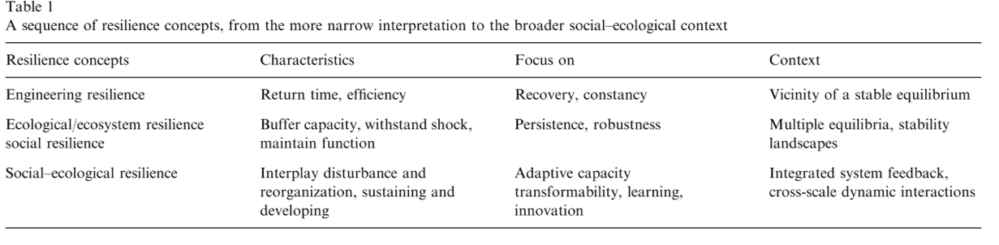
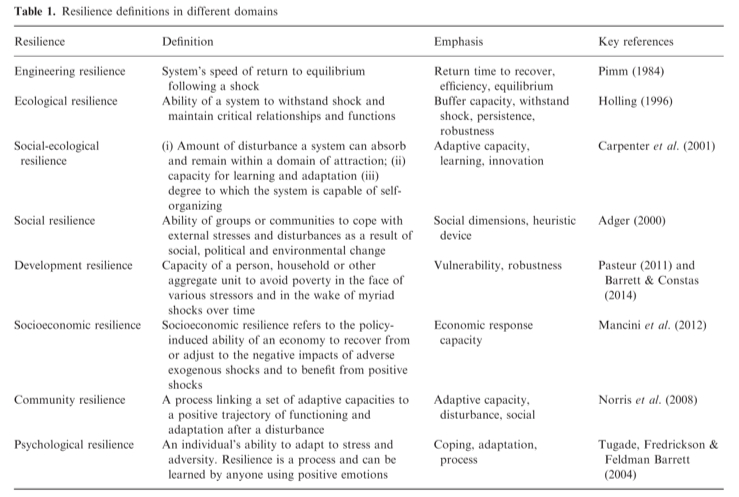

class: title, smokescreen, shelf, no-footer
background-image: url(web.jpg)

# Networks models and socioecosystems

---
class: fit-h1
# The resilience question

---
class: fit-h1
# The resilience question : a multidisciplinary concept

---
class:
# Resilience, complex system and networks
Resilience, robustness and vulnerability refers to structural characteristics
--

--

**Diversity and connectivity are key structural descriptors**
--

#### Scientific challenges :
- What are diversity-stability relationships?
- How connectivity affects resilience?
--
.absolute.w-50pct.h-3.pa-1.l-1.b-4.ba.bc-orange.bw-2.br-2[]

---
class:
# Connectivity and resilience

Connectedness impacts on resilience : both directions are possible!
> more connections dilute impacts of strong changes but also propagate disturbances

  - depends on network properties (e.g. centrality)
  - depends on the characteristics of the connnected components
  - depends on the number of connections
  - depends on the strength of connections

<!--------------------------------  -->

---
class: title, smokescreen, no-footer
background-image: url(nerve-cell.jpg)
# Networks
---
class:
# Networks and graph theory
> graph = network of points connected by lines

points = **nodes** (or vertices) and links/lines = **edges**
--

--

Matrix formalism

---
class: compact, h3-cl
# The expansion of graph theory
###### Koeninsberg Bridges ~1740 (Euler) -> preuve 1 siècle plus tard -> 1 siècle plus tard, graphs aléatoires

.absolute.w-50pct.h-3.pa-1.r-1.t-5["graph theory" (WoS)]
.absolute.w-50pct.h-3.pa-1.r-4.b-4[2019----------------------------------------------------------------1995]

---
class: col-2
# Interest of network approaches

1. depict systems with numerous interactions leading to complex and non-linear dynamics

2. an interdisciplinary object / bridges between disciplines

.absolute.r-1.t-30pct[WoS Research Categories]

---
class: compact
# Networks for ecological systems
###Nodes = species
--

#### Trophic networks
Edges = biomass transfert

<!-- Reconstruction from distributions and metaweb, traits -->

--

#### Bipartite/tripartite networks
Edges = pollinisation, parasitism, herbivory

--

#### Trees (specific type of networks)
Edges = phylogenetic/functional distances

---
class: compact
# Networks for ecological systems

#### Spatial ecological networks
Nodes = habitat patches ; Edges = distance

.absolute.r-3.t-2[Gonzales et al. 2017]

--
#### Metaecosystems (multi-layers networks)
Nodes = species / ecosystems

.absolute.l-7.b-3[Gounand et al. 2018]

---
class:
# Networks for socio-economic systems

####Economic networks and concepts
- stocks and flux
- metabolic networks (territorial ecology)

--

####Spatial networks

Human mobility

.absolute.r-1.b-3[Barbosa 2018, Physics Reports]

---
class:
# Networks for socio-economic systems

####Diversity of type of links between humans
- goods
- communication / information / knowledge transfert
- spatial (co-presence)
- physical vs non physical
- emotional

---
class:
# Networks for socioecosystems
### Multi-layers

--

.absolute.r-1.b-2[Quintescence Consorsium 2016]
--

.absolute.l-6.b-4.bg-white.ba[**nodes=species; links=interactions**]
--

.absolute.l-6.b-5.bg-white.ba[**nodes=individuals; links=common perceptions**]
--

.absolute.l-6.t-5.bg-white.ba[**nodes=group of individuals; links=transactions**]

--
.absolute.l-2.b-5.bg-white[What relationship between layers?]

---
class:
# Networks for socioecosystems
### Pattern analysis

Access to ressources

2-layers network

.absolute.r-2.b-2[Janssen et al. 2006, Bodin et al. 2009 (Ecology and Society)   Bodin and Tengo 2012 (Glob. Env. Change)]

---
class:
# Networks for socioecosystems
### Integrating multiple networks
Objective oriented (resilience of an ES)

Multiple type of links

Interdependence

.absolute.r-2.b-2[Dee et al. 2017, TREE]

---
class: roomy
# Challenges for SES networks
1. How to include **space and time** to depict transitions/trajectoires ?
--

2. How to deal with the diversity of **types of links** ?
--

3. **Interdisciplinarity** : which perspective ?
--

4. How to integrate **scales** ?
--

5. How to represent **systems' environments** in a context of strongly connected systems ? How to choose optimal borders ?

<!--------------------------------  -->

---
class: title, smokescreen, no-footer
background-image: url(Ecrins.png)
# A theoretical exemple

---
class: img-left
# Nodes : the human as another animal

**Habitat = Ecosystem/patch**: refers to a relatively homogeneous spatial unit and all its components (incl. species populations spatially restricted to the spatial unit)

**User**: refers to individuals or group of individuals that are not spatially restricted to one spatial unit

--

.absolute.l-2[This allows putting **humans and animals at the same level** of habitat use!]
.absolute.l-2.b-3[The definition is **scale independent**.]

---
class: img-left
# Links : a generalized trophic perspective

User-Habitat links (types):
1. **biomass**: implies a biomass transfert (production service, trophic links)
2. **structural** : implies the presence of the user in the habitat (cultural services, shelter function)
3. **distant**: regulation or cultural services

---
class: img-left, fit-h1
# Links : trophic web and metacommunities

--

User-user (direct) links: indirect beneficiary / higher trophic levels

--

Habitat-Habitat links :  spatial connectivity

---
class: img-left
# Network of networks

The network is built as **multi-layers**, including various **functions** that differ in their user-habitat primary link (herbivory, timber harvesting, fishing, vegetation structure, ...)

---
class: img-left
# Structural analysis

Explore interdependences and indirect interactions accross sectors analysing a metaweb

---
class: img-left
# Space and time : an ecological perspective

Using spatio-temporal model of habitats (e.g. landscape vegetation model)

Rules for different uses

Simulations and prospective

---
class: img-right
# Additional examples

- Petri-nets : a powerful tool
> A Petri net is a directed bipartite graph that has two types of elements, places and transitions, depicted as white circles and rectangles, respectively. A place can contain any number of tokens, depicted as black circles. A transition is enabled if all places connected to it as inputs contain at least one token

---
class: no-footer
background-image: url(vallonpierre.png)
# Thanks
         

 Slides can be found at http://iboulangeat.github.io/Slides/
 
Contact: isabelle.boulangeat@inrae.fr

