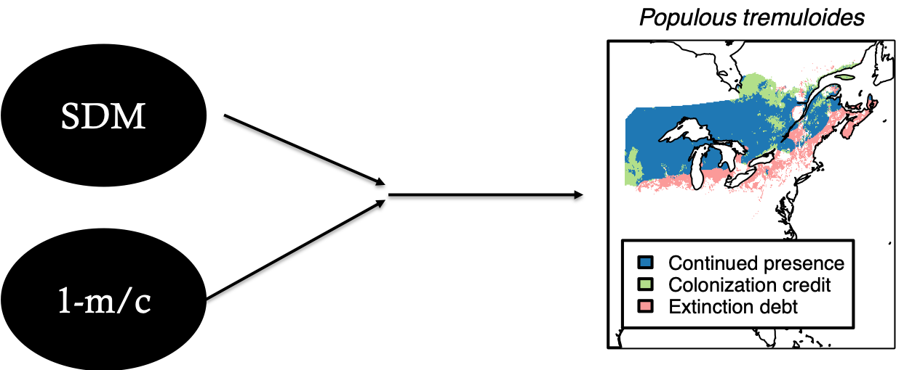
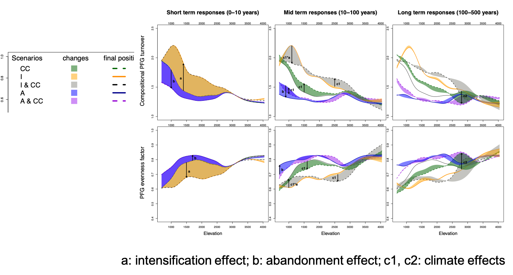

class: fullbleed, math
background-color: black

.absolute.w-100pct.pa-2.center.t-40pct.ba.bw-0.br-0.bg-white-80pct[
## <b>Predictive modelling of plant communities</b>   Challenges for a dynamical approach
]

---
layout: true
.footer[
<!-- - @DrIsaBlg -->
- <i class="fab fa-github"></i>iboulangeat
<!-- - isabelle.boulangeat@irstea.fr -->
- april 2019, ECOVEG 14, Toulouse
<!-- -  -->
]
<!--  -->

---

class:
# Prediction in community ecology

.absolute.l-4.t-4[**Why?**]
--
.absolute.l-10pct.t-5[climate change habitat fragmentation land-use changes changes in disturbances changes of human practices]

--
.absolute.r-6.t-4[**What?**]
--
.absolute.l-50pct.t-5[species composition species diversity (taxonomic, functional, phylogenetic) community-level attributes (annual biomass production, canopy height, ...)]

---

class:
# Modelling approach

---

class:
# From explanatory to anticipatory models
.absolute.r-2.b-2[Mouquet et al. 2015, JAE]

Why ? more data, more tools

--

<b>Explanatory</b> : theoretical expectations and tests (hypothetico-deductive)

<b>Anticipatory</b> : predictions\* conditionnal to hypotheses (models)  
\*forecasts, projections

--

but necessity for theoretical frameworks to build models in both cases

---

class:
# Coexistence theories

#### What explain the presence of a species in a particular place?
--

--

--

--

--

<!-- ========================================================================== -->

---
class: title, smokescreen, no-footer
background-image: url(abandon_static.png)
# Static approaches and their limits
---

class:
# The SDM framework

---

class:
# Explain with SDM

--
.absolute.r-2.b-2[Boulangeat et al. 2012, EcoLet]

--

---
class:
# Anticipate with stacked-SDM

--
   
Stack of multiple single-species SDM
--
  -> no species interactions

---
class:
# Including species interactions
1. Biotic elements as explicative variables (dominant species, community attribute, ...)
--

2. Joint modelling (jSDM) : conditional presence
.absolute.r-2.b-2[Pollock et al. 2014, MEE]

---
class: img-left
# Integrating stacked-SDM and assembly rules

.absolute.r-2.b-2[D'Amen et al. 2015, JOB and GEB]
--
 Historical and evolutionary constraints
 -> potential species pool ("Dark diversity")
--
 Abiotic constraints
 -> ex. SDM
--
 Macroecological constraints
 -> species richness and/or trait space
--
 Species interactions (assembly rules)
 -> random selection, MaxEnt, ...

---

class: fit-h1
# Predicting ecological communities : an overview
.absolute.r-2.b-2[D'Amen et al. 2017, Biol.Rev.]

<!-- ========================================================================== -->

---
class: title, smokescreen, no-footer
background-image: url(abandon.gif)
# Towards a dynamic perspective

---
class:
# Limit of a static approach

--
.fixed.bg-white-80pct.t-50pct.l-50pct[->colonisation credit]
.fixed.bg-white-80pct.t-80pct.l-50pct[->extinction debt]

---
class:
# Origin of lags

--
#####Rapid   global changes

IGBP and resilience center

--

--

---
class: fit-h1
# Consequences for multi-species modelling
 
Static approaches **infer** biotic interactions (and resulting community assembly) from species' co-occurrences
--
  -> Hypothesis of equilibrium

--
 
- May be a problem for calibration
- Is limiting for prediction of transient states
--

  Dynamic approaches can **simulate** species interactions

.absolute.r-2.b-2[Dormann et al. 2018, GEB]

<!-- ========================================================================== -->

---
class: title, smokescreen, no-footer
background-image: url(dandelion.jpg)
# Models based on metapopulation dynamics
---

class:
# From niche to neutral theories

---

class: fit-h1
# Models based on metapopulation dynamics

| STATES| **presence**| **absence**|
| ------| ---------| --------|
| **presence**| 1-p(e) | p(e) |
| **absence**| N.p(c)  | 1-N.p(c) |
 .absolute.fr.r-10pct.t-20pct.ofc.w-5-12th[e=extinction ; c=colonisation ; N=regional prevalence]
--

---

class: fit-h1
# Models based on metapopulation dynamics

.absolute.r-2.b-2[Talluto et al. 2017, Nature Ecology and Evolution]

---

class:
# Integrating biotic interactions
1. Biotic elements as explicative variables (dominant species, community attribute, ...)

2. Regroup species

3. Multi-species model
---

class:
# Integrating biotic interactions
Community level: 2 ~species
.absolute.r-2.b-2[Vissault et al., in revision]

--

--

--

--

--

---

class:
# Predictions: a simulation approach
.absolute.r-2.b-2[Vissault et al., in revision]
 

--

<!-- ========================================================================== -->

---
class: title, smokescreen, no-footer
background-image: url(melezein_ubac_freaux2.JPG)
# Dynamic vegetation models (DVM)
---
class:
# The interest of DVM
.absolute.r-2.b-2[Snell et al. 2014, Ecography]

1. Multi-species!
--

2. Dynamic (simulation models) : transient states and lags
--

3. Process-based interactions : potential to predict non-analog communities
--

4. Multi-scale : individual to landscape processes
--

5. Spatially explicit

--
  
Processes of interest: reproduction, establishment, growth, mortality

---
class: compact
# Dynamic vegetation models

**Forest gap models (stand models)**
 JABOWA (Botkin 1972), FORET (Shugart 1884), ZELIG (Smith 1988),
SORTIE (Deutschmann 1997)
 Aim : optimize **wood production** for harvest
 Principle : indiv. based models based on **competition for light**
--
  
**Forest Landscape Models (FLM)**
 
LANDIS (He 1999), LANDCLIM (Schumacher 2004),
TreeMig (Lischke 2006), LANDIS II (Scheller 2007)

 Aim : account for landscape processes (fire, seed dispersal)
 Principle : upscaling stand models
  - Cohorts, height classes, PFT, representative cells, ...
  - Aggregate spatial and temporal scales
 

---
class: compact, fit-h1
# Dynamic vegetation models

.absolute.r-2.b-5[Quillet et al. 2010, Env. Rev.]

**Dynamic Global Vegetation models (DGVM)**
 
LPJ (Sitch 2001), MC1 (Bachelet 2001)
 Aim : simulate **Net Primary Productivity**
 Principle : **Photosynthesis** ~ light + CO2 + temperature

--
  
**Combined DGVM and forest models**
 
LPJ-GUESS (Smith 2003), LM3-PPA (Weng 2015)
 Aim : improve the simulation of transitions between biomes
 Principle : model coupling (Hybrid-DGVM)

May include:
  - height-structured competition for light
  - within-PFT variation

---
class:
# A scaled overview

---
class: compact, img-left
# Beyond forest focus: an exemple with FATE-HD
FATE-HD among DVMs
  

.absolute.r-2.b-2[Boulangeat et al. 2014, GCB]

--

A landscape model dealing with **forest and non-forests**

- Response to climate (via Habitat model)
- Vegetation diversity (PFG)
- Simpified population dynamics (competition for light, dispersal, demography)
- Semi-quantitatif (easy to parameterize)
- Disturbances (fire, grazing, mowing)

---
class:
# FATE-HD model
.absolute.r-2.b-2[Boulangeat et al. 2014, GCB]

--

.absolute.r-4.t-3[Germination   Recruitment  Growth Survival Fecundity]

---
class:
# FATE-HD model
.absolute.r-2.b-2[Boulangeat et al. 2014, GCB]

.absolute.r-4.t-3[Germination   Recruitment  Growth Survival Fecundity]

--

--

---
class:
# FATE-HD model
.absolute.r-2.b-2[Boulangeat et al. 2014, GCB]

---
class:
# Parameterization : functional Groups

.absolute.r-2.b-2[Boulangeat et al. 2012, GCB]
---
class:
# Is it enough to represent biodiversity?

--

---
class:
# Is it enough to represent biodiversity?
  

---
class:
# Parameterization : data

.absolute.r-2.b-2[Boulangeat et al. 2014, Ecography]
---
class:
# FATE-HD vs SDM (at equilibrium)
Refine PFGs distribution inside their habitat limits

---
class:
# Scenarios

.absolute.r-2.b-2[Boulangeat et al. 2014, Ecography]

---
class:
# Scenarios

.absolute.l-4.t-30pct[Intensification]

<!-- .fixed.b-2.l-4[<video height="400" autoplay><source src="intens.mp4" type="video/mp4"></video>] -->
.absolute.r-5.t-30pct[Abandonment]

<!-- .fixed.b-2.r-4[<video height="400" autoplay><source src="abandon.mp4" type="video/mp4"></video>] -->
.absolute.r-2.b-2[Boulangeat et al. 2014, Ecography]

---
class:
# Changes in regional diversity

.absolute.r-2.b-2[Boulangeat et al. 2014, Ecography]

---
class:
# Changes in regional diversity
.absolute.r-2.b-2[Boulangeat et al. 2014, Ecography]

--

.absolute.l-3.t-5[additive effects]
--

.absolute.r-3.t-5[multiplicative effects]

---
class:
# Change in local diversity

.absolute.r-2.b-2[Boulangeat et al. 2014, Ecography]

---
class:
# Diversity decomposition
- change in **composition**
- change in **abundances**
.absolute.r-2.b-2[Boulangeat et al. 2014, Ecography]

--

\\[
^2D = ^0D \times EF
\\]

--
\\( ^0D = \\) richness -> beta = compositional turnover

\\( EF =\\) evenness factor -> beta = abundances re-arrangement

---
class: fit-h1, no-footer
# Changes over time, elevation and diversity dimensions

.absolute.r-2.b-2[Boulangeat et al. 2014, Ecography]

---
class: fit-h1
# Main highlights about the changes in functional diversity

.absolute.r-2.b-2[Boulangeat et al. 2014, Ecography]
--
 
**Effet of human land-use:**
Heterogeneity (beta) in average decreases in case of tree colonization but increases in case of habitat loss

**Effect of different PFG assemblages:**
The diversity response depends on elevation

**Interaction between drivers:**
Multiplicative effects are found when land abandonment is combined with climate change

---

class:
# Limits of DVMs

--

1. Difficult to parameterize
2. Difficult to evaluate error propagation
3. Limited to communities for which there is enough knowledge about constitutive species

--

Mechanisms with limited knowledge
- mortality and climate change induced mortality
- climate change impact on growth or water-use efficiency
- seeds (germination)
- phenology and shifts
- soil processes

<!-- ========================================================================== -->

---
class: title, smokescreen, no-footer
background-image: url(polarbear.png)
# Challenges and perspectives
---
class: fit-h1
# Scaling issues

--
- **space** : modelling dispersal and landscape disturbances
--

- **time** : from daily to annual processes
--

- **organisational levels** : represent the whole communities  (individuals->cohorts->populations->PFG->PFT->community attributes)

--
.absolute.r-2.b-30pct[_Biodiversity vs explicit processes,  a necessary trade-off_]

.absolute.r-2.b-2[Gallien et al. 2010, DID]

---

class:
# Modelling dispersal
#### Upscaling from individual processes to landscape levels
indiv. demography -> pop. demography -> metapopulation dynamics
--

1. Continuity in space and time for model calibration
  -> inverse modelling/metamodel, resampling, remote sensing data, ...
--

2. Resolution vs extent
  -> heterogeneity and spread within a cell see Snell et al. 2014, Ecography
--

3. Dispersal kernels
  -> A trait-based parameterisation see Tamme et al. 2014, Ecology
  -> Landscape properties that affect seed dispersal
  -> Vegetative reproduction

---

class:w
# Species interactions

- Dimension reduction
 -> Functional groups, using networks to reduce the dimension of interactions

--
- Ontology
 -> A mix between functional groups and age classes?
--

- Phenology
 -> May impact competition for light
--

- Interactions (competition and facilitation) via soil ressources (incl. water)
 -> necessary to improve herbaceous species modelling
--

- Trophic interactions
  ex. plant-pollinisator
  ex. effect of grazers on seed dispersal and nutrient enrichment

---

class:
# Response to global changes

 

**Climate change** : impacts on demography
  -> hybrid approach or inverse modelling?

--

**Human practices** : retroactions
  -> a prospective approach combining stories and simulations?

---

class:
# Conclusion

#### Necessary trade-offs
- Species number (or ecological scale) vs explicit processes
- Resolution vs extent (space and time)

#### Solutions
- Multi-scale model integration see Clark et al. 2009, Ecological Monograph ; Talluto et al. 2016, GEB
- Hybrid approaches (implicit and explicit processes) see Gallien et al. 2010, DID

---

class: no-footer
background-image: url(marais_acide_lautaret.JPG)
# Thanks

         
Slides can be found at http://iboulangeat.github.io/Slides/
 
Contact: isabelle.boulangeat@irstea.fr
